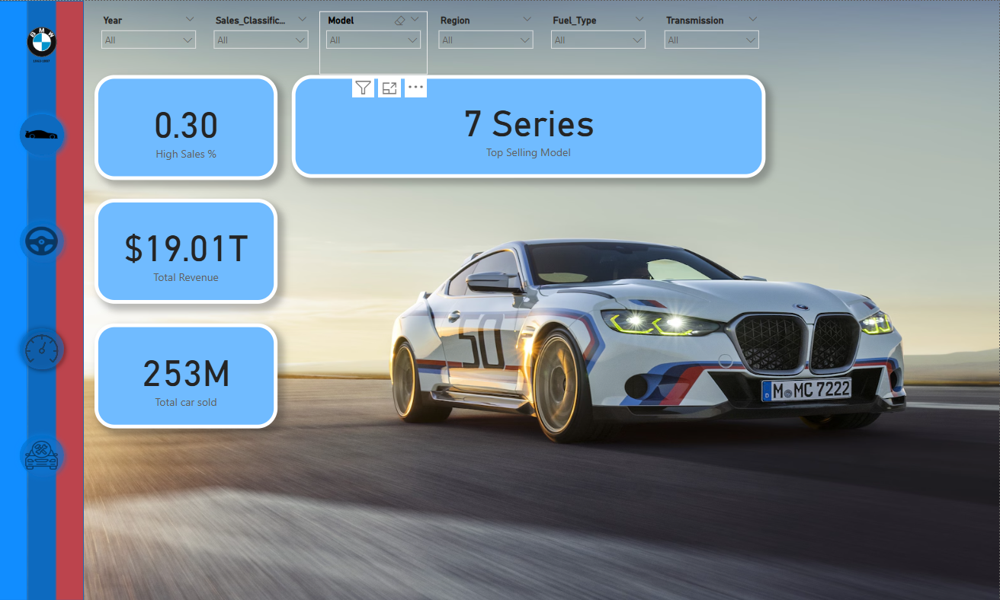

# BMW Sales & Performance Dashboard – Power BI Project

This project is a comprehensive **Power BI dashboard** analyzing BMW car sales, technical specifications, and performance classification across regions, models, and years. The interactive visual report delivers business insights for sales optimization and product strategy.

---

##  Dashboard Screenshots




---

## 📊 Features of the Dashboard

### 🔹 Page 1: Overview & KPIs
- 🧾 **Total Revenue**: Calculated as `Price × Sales Volume`
- 🚗 **Total Cars Sold**
- 🥇 **Top Selling Model**
- 📈 **High Sales %** from classification
- ⬜ Global slicers: Year, Region, Model, Fuel Type, Transmission

### 🔹 Page 2: Classification & Model Analysis
- Pie chart of **Sales_Classification** (High/Low)
- Bar chart: **Sales Volume by Model**
- Stacked bar: **Model vs Sales_Classification**

### 🔹 Page 3: Regional Performance
- Bar chart: **Sales Volume by Region**
- Clustered chart: **Sales_Classification by Region**

### 🔹 Page 4: Technical Analytics
- 📉 Line Chart: Price over Years (by Model)
- 📊 Scatter: Mileage vs Price
- 📦 Bar chart: Sales by Engine Size

---

## 🧠 Dataset Overview

| Column                | Description                          |
|-----------------------|--------------------------------------|
| `Model`               | BMW model name (e.g. 7 Series)       |
| `Year`                | Manufacturing year (2010–2024)       |
| `Region`              | Sales region (e.g. Asia, Europe)     |
| `Fuel_Type`           | Petrol, Diesel, Hybrid, Electric     |
| `Transmission`        | Manual / Automatic                   |
| `Engine_Size_L`       | Engine size in liters                |
| `Mileage_KM`          | Total driven distance in KM          |
| `Price_USD`           | Price of car in USD                  |
| `Sales_Volume`        | Units sold                           |
| `Sales_Classification`| High / Low label for classification  |

---

## 📐 Key DAX Measures

```DAX
Total Revenue = SUMX('BMW_Sales', 'BMW_Sales'[Price_USD] * 'BMW_Sales'[Sales_Volume])

Total Cars Sold = SUM('BMW_Sales'[Sales_Volume])

Top Selling Model = 
VAR Summary = SUMMARIZE('BMW_Sales', 'BMW_Sales'[Model], "Units", SUM('BMW_Sales'[Sales_Volume]))
VAR Top = TOPN(1, Summary, [Units], DESC)
RETURN MAXX(Top, 'BMW_Sales'[Model])

High Sales % = 
DIVIDE(
    CALCULATE(COUNTROWS('BMW_Sales'), 'BMW_Sales'[Sales_Classification] = "High"),
    COUNTROWS('BMW_Sales')
)
